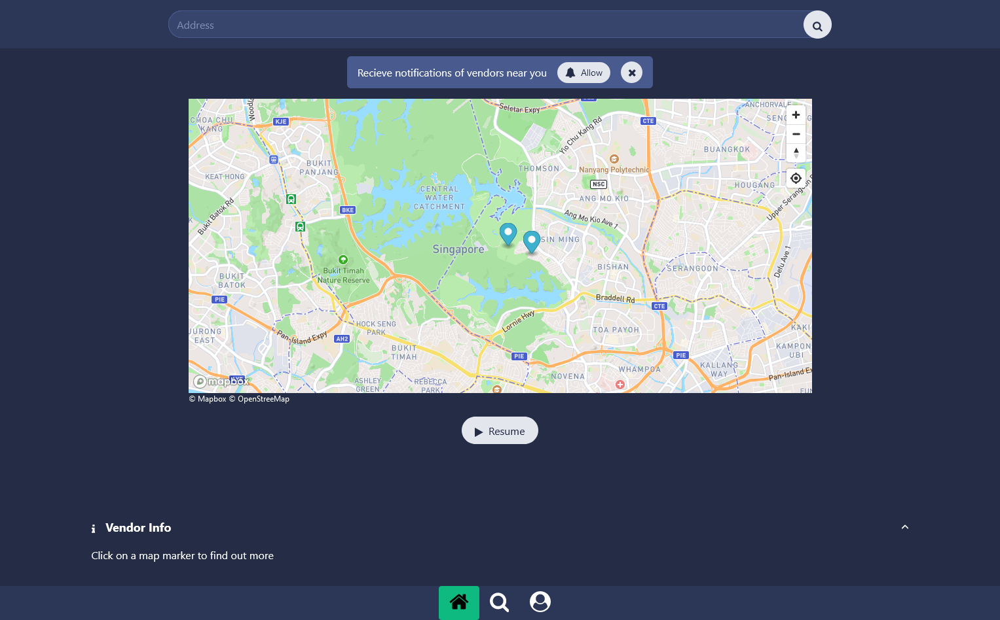

# foodtruck-broadcast
Allow foodtruck vendors to broadcast their foodtruck location to nearby customers.

# Tech stack
Front end: Svelte 4

Backend: `Go` microservices, with monorepo architecture

Infra: Terraform
